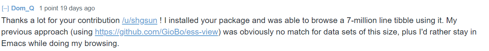
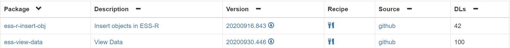

## 背景

[GNU Emacs](https://www.gnu.org/software/emacs/): An extensible, customizable, free/libre text editor --- and more.

它有另外一个“优势”，高度可定制，它自带的语言Elisp，几乎是图灵完备的，并且比较简单，按照RMS的想法是办公室里不会编程的小白（领）也可以很快的上手---指的是70年代末80年代初那时候。所以Emacs是一个编辑器，更是一个伪装成编辑器的操作系统，就差内核了，它的很多用户都希望 All in One. 

[ESS](https://ess.r-project.org): Emacs Speaks Statistics (ESS) is an add-on package for GNU Emacs. It is designed to support editing of scripts and interaction with various statistical analysis programs such as R, S-Plus, SAS, Stata and OpenBUGS/JAGS. 
总之，也是 All in One. 离开ESS我几乎不会用 SAS 和 R 了。

## 数据处理

在数据处理的过程中，难免一个需求：经常查看一下数据。比如一个数据集data.frame，里边有哪些变量，有哪些值，经过一些处理后数据变成了什么样子。SAS里有数据查看器，Rstudio里也有查看数据的，Emacs里也有。SAS和Rstudio里的都不趁手，也没法自己定制；Emacs里的太简陋。但是Emacs可定制啊。

以此可以看出Emacs用户的 All in One 观念有多顽固，以及，世界太大，哪怕一个人的小小需求也可能有上百人有同样的需求：

下载量破百，用户数80以上。

## ess-view-data

[ess-view-data](https://github.com/ShuguangSun/ess-view-data) 就是这样的工具：To do tidyverse-like view and manipulate data in ESS and R. 可以查看数据，也可以临时的操作data.frame --- 如果是SAS数据集，可以先在R里用haven导入。还有tidyverse的多种verb，比如select, filter等，还可以count, summarise等，所以还是很方便 --- 真·经过岁月洗礼的个人需求导向。

曾经想把它“扔给”ESS来着，理由太露骨：我有个工具，没时间打理，你们要不要。得到的回复也很坚决：“We're all a bit pressed regarding time as well, so we don't really have time to maintain this either ;)”....

## 开源与分享

有些工具可以惠及业界、学术界，很多的人；有些工具可以帮助一些有共同需求的人。不必考虑影像，开源与分享可以获得更多。
